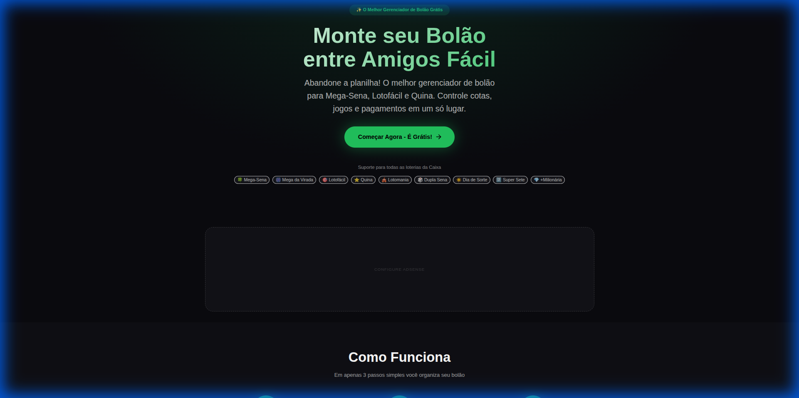
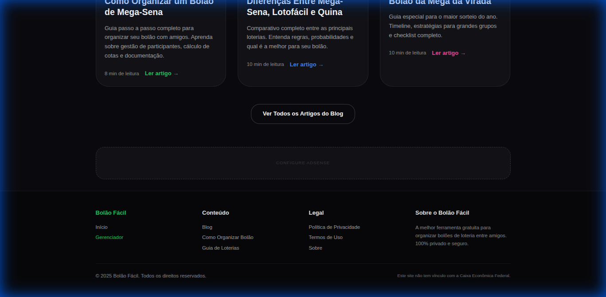
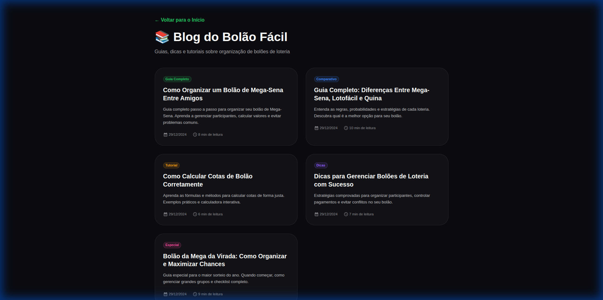
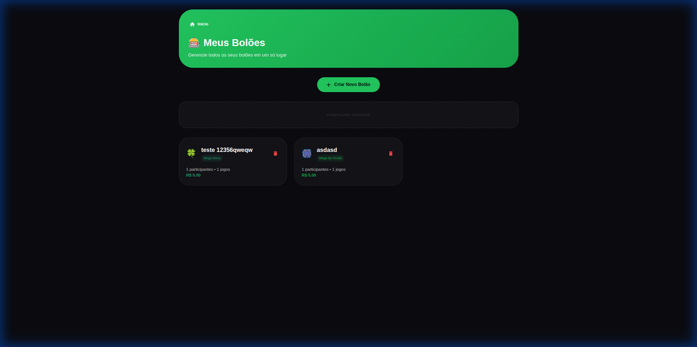

# 🎰 Bolão Fácil

**A melhor ferramenta gratuita para organizar bolões de loteria entre amigos**

[](https://nextjs.org/)
[](https://reactjs.org/)
[](https://www.typescriptlang.org/)
[](https://mui.com/)
[](LICENSE)

## 📋 Índice

- [Sobre o Projeto](#sobre-o-projeto)
- [Screenshots](#screenshots)
- [Funcionalidades](#funcionalidades)
- [Tecnologias Utilizadas](#tecnologias-utilizadas)
- [Instalação e Configuração](#instalação-e-configuração)
- [Configuração do Google AdSense](#configuração-do-google-adsense)
- [Estrutura do Projeto](#estrutura-do-projeto)
- [Deploy](#deploy)
- [Contribuindo](#contribuindo)
- [Licença](#licença)

## 🎯 Sobre o Projeto

O **Bolão Fácil** nasceu da necessidade de simplificar a organização de bolões de loteria. Cansado de usar planilhas complicadas e perder o controle de quem pagou ou não, criei esta ferramenta para tornar todo o processo mais fácil, transparente e profissional.

### Por Que Criei Este Projeto?

- **Problema Real**: Organizar bolões manualmente é trabalhoso e propenso a erros
- **Privacidade**: Queria uma solução que não exigisse envio de dados pessoais para servidores
- **Gratuito**: Acredito que ferramentas úteis devem ser acessíveis a todos
- **Aprendizado**: Oportunidade de trabalhar com tecnologias modernas (Next.js 14, React 18, TypeScript)

## 📸 Screenshots

### Página Inicial

*Landing page com design moderno e call-to-action claro*

### Seção de Blog na Homepage

*Destaque para artigos educativos diretamente na página inicial*

### Blog com Conteúdo Educacional

*5 artigos completos sobre organização de bolões (6.900+ palavras)*

### Gerenciador de Bolões

*Interface intuitiva para criar e gerenciar bolões*

## ✨ Funcionalidades

### Gerenciamento Completo
- ✅ Criar e gerenciar múltiplos bolões
- ✅ Adicionar participantes ilimitados
- ✅ Registrar jogos de qualquer loteria (Mega-Sena, Lotofácil, Quina, etc.)
- ✅ Controle de pagamentos por participante
- ✅ Cálculo automático de cotas e valores

### Privacidade e Segurança
- 🔒 **100% Privado**: Todos os dados ficam no navegador (localStorage)
- 🔒 Nenhuma informação enviada para servidores
- 🔒 Sem cadastro ou login necessário
- 🔒 Funciona offline após carregamento inicial

### Recursos Adicionais
- 📄 Exportação em PDF profissional
- 📱 Responsivo (funciona em qualquer dispositivo)
- 🌐 PWA (pode ser instalado como app)
- 🎨 Interface moderna e intuitiva
- 📊 Suporte a todas as loterias da Caixa

### Conteúdo Educacional
- 📝 Blog com 5 artigos completos sobre organização de bolões
- 📚 Guias passo a passo
- 💡 Dicas e melhores práticas
- 📖 Páginas legais (Privacidade, Termos, Sobre)

## 🛠️ Tecnologias Utilizadas

### Frontend
- **[Next.js 14](https://nextjs.org/)** - Framework React com App Router
- **[React 18](https://reactjs.org/)** - Biblioteca UI
- **[TypeScript](https://www.typescriptlang.org/)** - Tipagem estática
- **[Material-UI (MUI) 5](https://mui.com/)** - Componentes UI

### Armazenamento e Estado
- **LocalStorage API** - Armazenamento local de dados
- **React Hooks** - Gerenciamento de estado

### SEO e Analytics
- **Next.js Metadata API** - SEO otimizado
- **Schema.org JSON-LD** - Dados estruturados
- **Google AdSense** - Monetização

### Outras Ferramentas
- **jsPDF** - Geração de PDFs
- **ESLint** - Linting de código
- **Git** - Controle de versão

## 🚀 Instalação e Configuração

### Pré-requisitos
- Node.js 18+ instalado
- npm ou yarn

### Passo a Passo

1. **Clone o repositório**
```bash
git clone https://github.com/Advansoftware/bolao-facil.git
cd bolao-facil
```

2. **Instale as dependências**
```bash
npm install
# ou
yarn install
```

3. **Configure as variáveis de ambiente (opcional)**

Crie um arquivo `.env.local` na raiz do projeto:

```env
# Google AdSense (opcional - veja seção abaixo)
NEXT_PUBLIC_ADSENSE_ENABLED=false
NEXT_PUBLIC_ADSENSE_PUBLISHER_ID=ca-pub-XXXXXXXXXXXXXXXX
NEXT_PUBLIC_ADSENSE_SLOT_HEADER=XXXXXXXXXX
NEXT_PUBLIC_ADSENSE_SLOT_RECTANGLE=XXXXXXXXXX
NEXT_PUBLIC_ADSENSE_SLOT_FOOTER=XXXXXXXXXX
NEXT_PUBLIC_ADSENSE_SLOT_ARTICLE=XXXXXXXXXX
NEXT_PUBLIC_ADSENSE_SLOT_SIDEBAR=XXXXXXXXXX
```

4. **Execute o servidor de desenvolvimento**
```bash
npm run dev
# ou
yarn dev
```

5. **Abra no navegador**
```
http://localhost:3000
```

## 💰 Configuração do Google AdSense

O projeto está preparado para integração com Google AdSense. Siga os passos abaixo:

### 1. Obtenha suas Credenciais do AdSense

1. Acesse [Google AdSense](https://www.google.com/adsense/)
2. Faça login ou crie uma conta
3. Vá em **Anúncios** > **Visão geral**
4. Copie seu **Publisher ID** (formato: `ca-pub-XXXXXXXXXXXXXXXX`)

### 2. Crie Unidades de Anúncio

No painel do AdSense, crie as seguintes unidades de anúncio:

- **Header Leaderboard** (728x90 ou responsivo)
- **Medium Rectangle** (300x250)
- **Footer Leaderboard** (728x90 ou responsivo)
- **In-Article** (responsivo)
- **Sidebar** (160x600 - opcional)

Para cada unidade, copie o **Slot ID**.

### 3. Configure o Projeto

Edite o arquivo `lib/adsense-config.ts`:

```typescript
export const ADSENSE_CONFIG = {
  // Substitua com seu Publisher ID
  publisherId: 'ca-pub-XXXXXXXXXXXXXXXX', // ← SEU PUBLISHER ID AQUI
  
  slots: {
    headerLeaderboard: 'XXXXXXXXXX', // ← SEU SLOT ID AQUI
    mediumRectangle: 'XXXXXXXXXX',   // ← SEU SLOT ID AQUI
    footerLeaderboard: 'XXXXXXXXXX', // ← SEU SLOT ID AQUI
    inArticle: 'XXXXXXXXXX',         // ← SEU SLOT ID AQUI
    sidebar: 'XXXXXXXXXX',           // ← SEU SLOT ID AQUI (opcional)
  },
  
  // Habilite em produção
  enabled: process.env.NODE_ENV === 'production',
};
```

**OU** use variáveis de ambiente no `.env.local`:

```env
NEXT_PUBLIC_ADSENSE_ENABLED=true
NEXT_PUBLIC_ADSENSE_PUBLISHER_ID=ca-pub-XXXXXXXXXXXXXXXX
NEXT_PUBLIC_ADSENSE_SLOT_HEADER=XXXXXXXXXX
NEXT_PUBLIC_ADSENSE_SLOT_RECTANGLE=XXXXXXXXXX
NEXT_PUBLIC_ADSENSE_SLOT_FOOTER=XXXXXXXXXX
NEXT_PUBLIC_ADSENSE_SLOT_ARTICLE=XXXXXXXXXX
NEXT_PUBLIC_ADSENSE_SLOT_SIDEBAR=XXXXXXXXXX
```

### 4. Teste em Produção

```bash
npm run build
npm start
```

Os anúncios só aparecerão em produção (`NODE_ENV=production`). Em desenvolvimento, você verá placeholders.

### 5. Deploy e Verificação

1. Faça deploy do site (Vercel, Netlify, etc.)
2. No painel do AdSense, adicione seu domínio
3. Aguarde aprovação (pode levar alguns dias)
4. Verifique se os anúncios estão aparecendo corretamente

## 📁 Estrutura do Projeto

```
bolao-facil/
├── app/                          # App Router do Next.js
│   ├── blog/                     # Páginas do blog
│   │   ├── page.tsx             # Lista de artigos
│   │   ├── como-organizar-bolao-mega-sena/
│   │   ├── diferencas-mega-sena-lotofacil-quina/
│   │   ├── calcular-cotas-bolao/
│   │   ├── dicas-gerenciar-boloes/
│   │   └── bolao-mega-virada/
│   ├── gerenciador/             # Aplicação principal
│   │   └── page.tsx
│   ├── privacidade/             # Política de privacidade
│   ├── termos/                  # Termos de uso
│   ├── sobre/                   # Sobre o projeto
│   ├── layout.tsx               # Layout raiz
│   ├── page.tsx                 # Landing page
│   └── globals.css              # Estilos globais
├── components/                   # Componentes React
│   ├── AdSense.tsx              # Componente AdSense
│   ├── AdPlaceholder.tsx        # Placeholder para dev
│   ├── Footer.tsx               # Rodapé
│   ├── BolaoExport.tsx          # Exportação PDF
│   └── ParticipantSection.tsx   # Seção de participantes
├── lib/                          # Bibliotecas e utilitários
│   ├── adsense-config.ts        # Configuração AdSense
│   ├── lottery-types.ts         # Tipos de loteria
│   └── storage.ts               # LocalStorage API
├── public/                       # Arquivos estáticos
│   ├── sitemap.xml              # Sitemap SEO
│   ├── robots.txt               # Robots SEO
│   └── manifest.json            # PWA manifest
├── README.md                     # Este arquivo
├── package.json                  # Dependências
└── next.config.ts               # Configuração Next.js
```

## 🌐 Deploy

### Vercel (Recomendado)

1. Faça push do código para GitHub
2. Acesse [Vercel](https://vercel.com)
3. Importe o repositório
4. Configure as variáveis de ambiente (se usar)
5. Deploy!

### Netlify

1. Faça push do código para GitHub
2. Acesse [Netlify](https://netlify.com)
3. Conecte o repositório
4. Build command: `npm run build`
5. Publish directory: `.next`
6. Deploy!

### Outros Provedores

O projeto é compatível com qualquer provedor que suporte Next.js:
- AWS Amplify
- Google Cloud Run
- Azure Static Web Apps
- Railway
- Render

## 🤝 Contribuindo

Contribuições são bem-vindas! Sinta-se à vontade para:

1. Fork o projeto
2. Crie uma branch para sua feature (`git checkout -b feature/AmazingFeature`)
3. Commit suas mudanças (`git commit -m 'Add some AmazingFeature'`)
4. Push para a branch (`git push origin feature/AmazingFeature`)
5. Abra um Pull Request

## 📝 Licença

Este projeto está sob a licença MIT. Veja o arquivo [LICENSE](LICENSE) para mais detalhes.

## 👨‍💻 Autor

Criado com ❤️ para facilitar a vida de quem organiza bolões.

**Motivação**: Este projeto surgiu da minha própria necessidade de organizar bolões de forma mais eficiente. Cansado de planilhas confusas e falta de controle, decidi criar uma solução moderna, gratuita e que respeitasse a privacidade dos usuários.

## 🙏 Agradecimentos

- Comunidade Next.js pela excelente documentação
- Material-UI pela biblioteca de componentes
- Todos que testaram e deram feedback

---

**⭐ Se este projeto te ajudou, considere dar uma estrela no GitHub!**

**🐛 Encontrou um bug?** Abra uma [issue](https://github.com/Advansoftware/bolao-facil/issues)

**💡 Tem uma sugestão?** Adoraria ouvir! Abra uma [issue](https://github.com/Advansoftware/bolao-facil/issues) ou envie um PR
